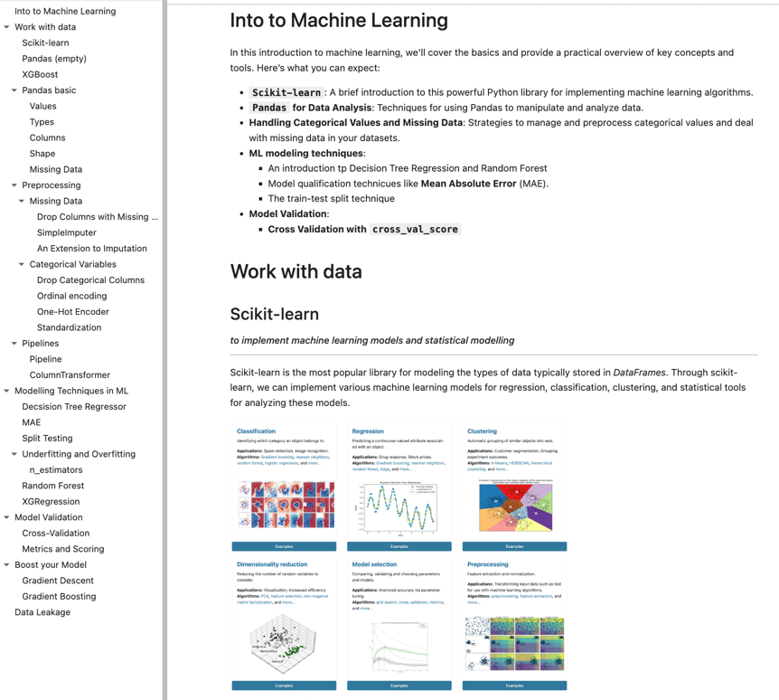

## Machine Learning projects and notes

### Vectors Properties
- [[Vectors]]: 
	- Mathematical objects representing quantities with both magnitude and direction, often expressed in coordinate form.
- [[Linear combinations and spans]]
	- A linear combination involves *summing scaled versions of vectors*; 
	- **span** is the *set of all possible linear combinations* of a given set of vectors.
- [[Programmimg/Math/Subspaces and the basis for a subspace|Subspaces and the basis for a subspace]]
	- A **subspace** is a *set of vectors closed under vector addition and scalar multiplication*. 
	- A **basis** is a *minimal set of vectors that span the subspace.*
- [[Linear Dependance and Independence]]
	- **Linear Independence**: *No vector can be expressed as a combination of others*. (**unique solution** exists). There is not noise. 
	- **Linear Dependence**: At least one vector can be represented as a combination of others. **Infinitely many solutions** or **no solution** may exist.

### Manual methods to solve system of linear equations:

- **Crammer Method (2x2) (3x3)**: 
	- A method using determinants to solve systems of linear equations. It works well for *small systems* but is inefficient for larger ones. *If* the *determinant == 0*, the system *has no unique solution*.
- [[Gaussian Elimination]]: 
	- A systematic *method for simplifying systems of linear equations* through row operations to reach an upper triangular form, facilitating back substitution.
- [[Gauss-Jordan Elimination]]: 
	- An *extension of Gaussian elimination* that transforms the matrix to reduced row echelon form (*RREF*)  ( results to [[I - Identity Matrix]]), allowing for direct reading of solutions without back substitution.

### Matrix Properties

-  [[Matrix Vector Multiplication]]
	- linear transformation by multiplication.
- [[Basis for the Column Space of a Matrix]]
	- A set of linearly independent column vectors in a matrix that spans the column space, crucial for understanding the matrix's range.
- [[Inverse Matrix]]inverse is just like identity divided by matrix
	- $A \cdot A^{-1} = A^{-1} \cdot A = I$
	- **Adjugate and Determinant Method**: 
		- *(2x2)*: $A^{-1} = \frac{1}{ad - bc} \begin{pmatrix} d & -b \\ -c & a \end{pmatrix}$
		- *(>3x3)*: $\text{det}(E) = a(ei - fh) - b(di - fg) + c(dh - eg)$
	- [[Gauss-Jordan Elimination]]: 
		- Augmented Matrix Transformation: $[U ∣ I]$ into the form $[I ∣ U^{-1}]$ 
		- Why it works? : *let say $U=2$, $I=1$, what is $U^{-1}$?*
			- $2 | 1$ => $\frac{R1}{2}$ => $\frac{2}{2}$ => $1|0.5$
			- $2*0.5=1$
